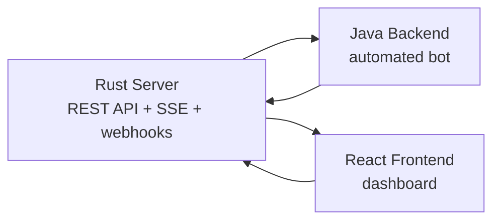

# Offworld Bot Client Test

Complete Offworld project with three components:

- `server/` : Rust game server
- `backend/` : reactive Java bot
- `frontend/` : React dashboard

## Team

Project done by:

- Abdellatif EL-MAHDAOUI
- Alaa BOUGHAMMOURA
- Betsaleel CLOVIS

## Quick overview



## Stack

- server: Rust, Axum, Tokio
- backend: Java 21, Spring Boot WebFlux, Project Reactor, Maven
- frontend: React, Vite

## Getting Started

### 1. Start the server

```bash
cd server
cargo run -- --seed seed.json
```

Server default: `http://localhost:3000`

### 2. Start three bots together

Open three terminals for the Java backend and run one bot per player.

Bot 1: `alpha-team`

```bash
cd backend
mvn spring-boot:run -Dspring-boot.run.arguments="--server.port=8081 --offworld.server-url=http://localhost:3000 --offworld.player-id=alpha-team --offworld.api-key=alpha-secret-key-001 --offworld.webhook-url=http://localhost:8081/webhooks --offworld.strategy-interval-ms=8000"
```

Bot 2: `beta-corp`

```bash
cd backend
mvn spring-boot:run -Dspring-boot.run.arguments="--server.port=8082 --offworld.server-url=http://localhost:3000 --offworld.player-id=beta-corp --offworld.api-key=beta-secret-key-002 --offworld.webhook-url=http://localhost:8082/webhooks --offworld.strategy-interval-ms=9000"
```

Bot 3: `gamma-guild`

```bash
cd backend
mvn spring-boot:run -Dspring-boot.run.arguments="--server.port=8083 --offworld.server-url=http://localhost:3000 --offworld.player-id=gamma-guild --offworld.api-key=gamma-secret-key-003 --offworld.webhook-url=http://localhost:8083/webhooks --offworld.strategy-interval-ms=10000"
```

### 3. Configure the frontend or switch active player

In the dashboard connection panel, use one of these credential pairs:

- `alpha-team` / `alpha-secret-key-001`
- `beta-corp` / `beta-secret-key-002`
- `gamma-guild` / `gamma-secret-key-003`

### 4. Optional single-bot configuration

In `backend/src/main/resources/application.yml` :

```yaml
offworld:
  server-url: http://localhost:3000
  player-id: "alpha-team"
  api-key: "alpha-secret-key-001"
  webhook-url: "http://localhost:8081/webhooks"

server:
  port: 8081
```

### 5. Start the frontend

```bash
cd frontend
npm install
npm run dev
```

Frontend default: `http://localhost:5173`

## Multi-bot behavior

- each bot runs its own webhook server on a unique port
- each bot uses a different player ID and API key
- different strategy intervals help avoid all bots acting at the exact same moment
- the frontend can switch between bots by changing the connection credentials

## Build and tests

```bash
cd server && cargo test
cd backend && mvn test
cd frontend && npm run build && npm run lint
```

## What to read where

- `backend/README.md` : build, configuration, execution, reactive library choice
- `backend/ARCHITECTURE.md` : short reactive architecture with diagrams
- `frontend/README.md` : dashboard startup and functionality
- `server/docs/` : detailed API documentation