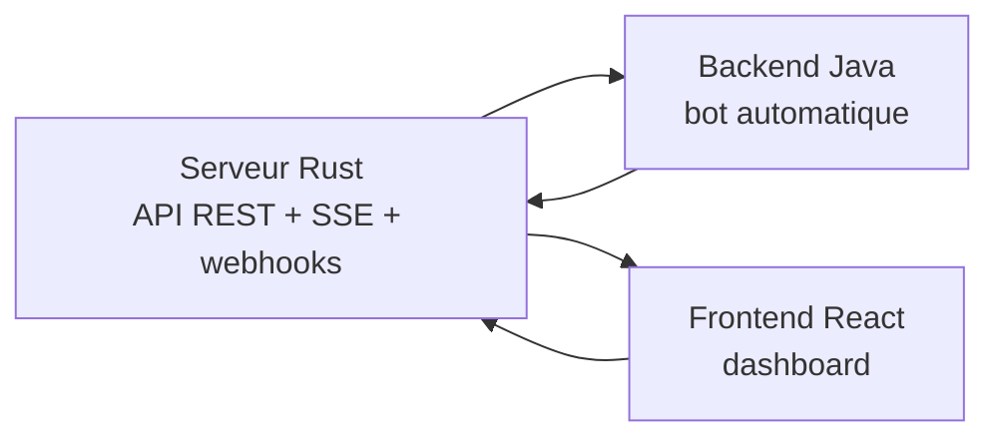

# Offworld Bot Client Test

Projet Offworld complet avec trois briques :

- `server/` : serveur de jeu Rust
- `backend/` : bot Java réactif
- `frontend/` : dashboard React

## Vue rapide



## Stack

- serveur : Rust, Axum, Tokio
- backend : Java 21, Spring Boot WebFlux, Project Reactor, Maven
- frontend : React, Vite

## Démarrage

### 1. Lancer le serveur

```bash
cd server
cargo run -- --seed seed.json
```

Serveur par défaut : `http://localhost:3000`

### 2. Configurer le backend

Dans `backend/src/main/resources/application.yml` :

```yaml
offworld:
  server-url: http://localhost:3000
  player-id: "alpha-team"
  api-key: "alpha-secret-key-001"
  webhook-url: "http://localhost:8081/webhooks"

server:
  port: 8081
```

### 3. Lancer le backend

```bash
cd backend
mvn spring-boot:run
```

### 4. Lancer le frontend

```bash
cd frontend
npm install
npm run dev
```

Frontend par défaut : `http://localhost:5173`

## Build et tests

```bash
cd server && cargo test
cd backend && mvn test
cd frontend && npm run build && npm run lint
```

## Où lire quoi

- `backend/README.md` : build, configuration, exécution, choix de la librairie réactive
- `backend/ARCHITECTURE.md` : architecture réactive courte avec diagrammes
- `frontend/README.md` : lancement et fonctionnement du dashboard
- `server/docs/` : documentation API détaillée