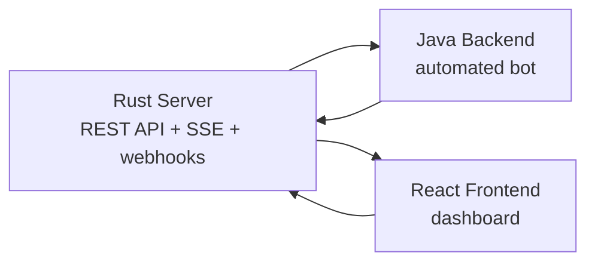

# Offworld Bot Client Test

Complete Offworld project with three components:

- `server/` : Rust game server
- `backend/` : reactive Java bot
- `frontend/` : React dashboard

## Quick overview



## Stack

- server: Rust, Axum, Tokio
- backend: Java 21, Spring Boot WebFlux, Project Reactor, Maven
- frontend: React, Vite

## Getting Started

### 1. Start the server

```bash
cd server
cargo run -- --seed seed.json
```

Server default: `http://localhost:3000`

### 2. Configure the backend

In `backend/src/main/resources/application.yml` :

```yaml
offworld:
  server-url: http://localhost:3000
  player-id: "alpha-team"
  api-key: "alpha-secret-key-001"
  webhook-url: "http://localhost:8081/webhooks"

server:
  port: 8081
```

### 3. Start the backend

```bash
cd backend
mvn spring-boot:run
```

### 4. Start the frontend

```bash
cd frontend
npm install
npm run dev
```

Frontend default: `http://localhost:5173`

## Build and tests

```bash
cd server && cargo test
cd backend && mvn test
cd frontend && npm run build && npm run lint
```

## What to read where

- `backend/README.md` : build, configuration, execution, reactive library choice
- `backend/ARCHITECTURE.md` : short reactive architecture with diagrams
- `frontend/README.md` : dashboard startup and functionality
- `server/docs/` : detailed API documentation