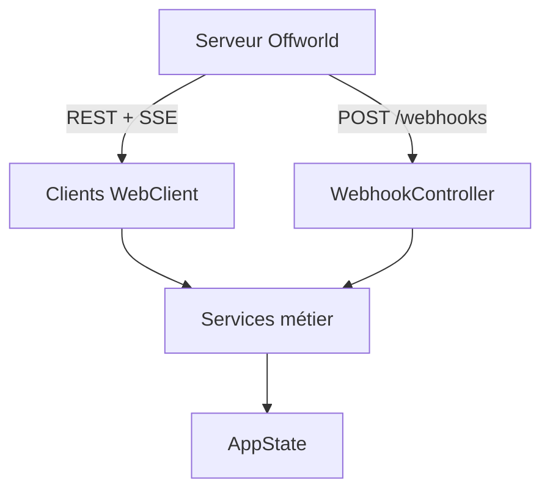
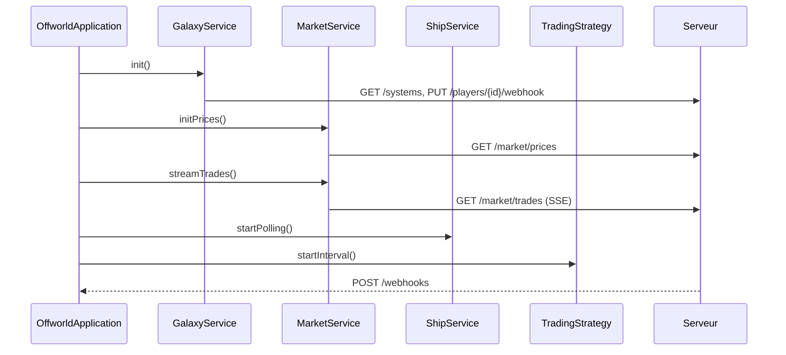

# Architecture — Offworld Bot Client

## Objectif

Le bot Java pilote automatiquement une station Offworld en combinant quatre modes d'interaction :

- requêtes HTTP non bloquantes
- polling périodique
- flux SSE du marché
- webhooks entrants

## Librairie choisie

**Project Reactor** via **Spring WebFlux**.

Cette pile permet d'utiliser `Mono` et `Flux` sur toute la chaîne, avec le même modèle pour appeler l'API, planifier les boucles, traiter le SSE et exposer le serveur webhook.

## Vue d'ensemble

## Flux principal

## Intégration des patterns réactifs

### 1. Sync non bloquant

Les appels REST classiques utilisent `WebClient` et retournent des `Mono` ou `Flux`.

Usage : initialisation, lecture des prix, lecture des inventaires, placement d'ordres.

### 2. Polling

Les boucles périodiques utilisent `Flux.interval()`.

Usage :

- polling des vaisseaux toutes les quelques secondes
- boucle de stratégie à intervalle fixe

### 3. SSE

Le flux `GET /market/trades` est consommé comme un `Flux` infini.

Usage : mise à jour continue du cache de prix et adaptation de la stratégie.

### 4. Webhooks

Le backend expose `POST /webhooks` et traite les événements en asynchrone.

Usage : arrivées, docking, undocking et autres transitions du cycle de vie des vaisseaux.

### 5. Appel bloquant isolé

Le transfert par ascenseur spatial est isolé sur `Schedulers.boundedElastic()` pour éviter de bloquer les threads réactifs.

## Résumé

L'architecture repose sur une idée simple :

- `WebClient` pour parler au serveur
- des services Reactor pour orchestrer les actions
- `AppState` pour partager l'état courant
- SSE, polling et webhooks pour garder le bot synchronisé avec le jeu
