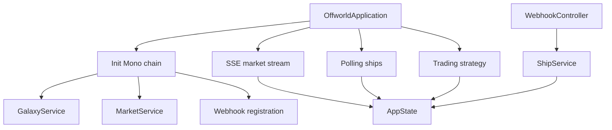

# Offworld Bot Client

Reactive Java client to automate trading on the Offworld Trading Manager server.

## Reactive library chosen

We chose **Project Reactor** via **Spring WebFlux**.

Why:

- `WebClient` is natively reactive and covers all HTTP calls in the project
- Reactor provides directly `Mono`, `Flux`, `flatMap`, `zip`, `retry`, `timeout` and `Flux.interval`
- Spring Boot simplifies the webhook server and dependency injection
- the stack covers all required patterns: non-blocking sync, polling, SSE and webhooks

## Build

```bash
cd backend
mvn test
```

## Configuration

Main file: `src/main/resources/application.yml`

```yaml
offworld:
  server-url: http://localhost:3000
  player-id: "alpha-team"
  api-key: "alpha-secret-key-001"
  webhook-url: "http://localhost:8081/webhooks"
  ship-polling-interval-ms: 4000
  strategy-interval-ms: 20000

server:
  port: 8081
```

## Execution

### 1. Start the game server

From `server/` :

```bash
cargo run -- --seed seed.json
```

### 2. Start the bot

From `backend/` :

```bash
mvn spring-boot:run
```

## What the application does

- loads the galaxy and prices at startup
- registers the player's webhook URL
- listens to the market SSE stream
- polls the state of ships
- executes a periodic strategy loop
- processes push events via `POST /webhooks`

## Reactive pipeline



## Architecture

The short architecture document is in `ARCHITECTURE.md`.

```
Game server
  └─ POST http://localhost:8081/webhooks  { "type": "ship_docked", ... }
       └─ WebhookController.handleEvent(event)   Mono<ResponseEntity>
            └─ switch(event.type)
                 ├─ SHIP_DOCKED    → ShipService.authorizeDocking(shipId)
                 └─ SHIP_UNDOCKED  → ShipService.authorizeUndocking(shipId)
```

Pattern used: **reactive Spring WebFlux handler** — `@PostMapping` returns a `Mono<ResponseEntity>`, Spring Netty processes the request without blocking. Java 21 `sealed interfaces` make pattern matching exhaustive and safe.

---

#### 6. Ascenseur spatial (toutes les 60 secondes, thread dédié)

L'API de l'ascenseur est synchrone côté serveur (délai artificiel ~2s). Elle est isolée dans un thread bloquant via `Schedulers.boundedElastic()` pour ne pas bloquer le thread réactif :

```
Flux.interval(Duration.ofSeconds(60))
  └─ .flatMap(_ → Mono.fromCallable(() → StationClient.transferElevator())
                       .subscribeOn(Schedulers.boundedElastic()))
```

Pattern utilisé : **`Mono.fromCallable()` + `subscribeOn(boundedElastic)`** — isolation du code bloquant dans un pool de threads dédié, sans contaminer le scheduler NIO.

---

### Résumé des patterns réactifs utilisés

| Mode              | Pattern Reactor                          | Classe(s) concernée(s)              |
|-------------------|------------------------------------------|--------------------------------------|
| Init synchrone    | `Mono` chaîné par `.then()` + `.block()` | `OffworldApplication`, `GalaxyService` |
| SSE temps réel    | `Flux<ServerSentEvent>` + `retryWhen`    | `MarketClient`, `MarketService`      |
| Polling ships     | `Flux.interval()` + `flatMap`            | `ShipService`                        |
| Stratégie trading | `Flux.interval()` + `flatMap` + `Mono`   | `TradingStrategy`                    |
| Webhooks push     | `@PostMapping` → `Mono<ResponseEntity>`  | `WebhookController`                  |
| Appel bloquant    | `Mono.fromCallable()` + `boundedElastic` | `ElevatorService`, `StationClient`   |
