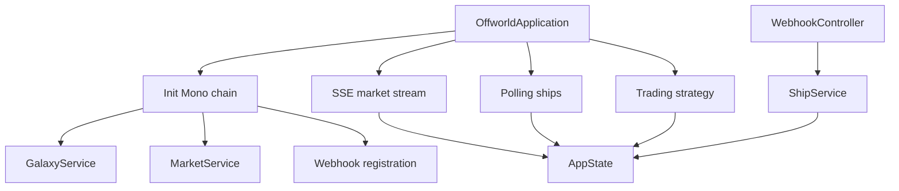

# Offworld Bot Client

Reactive Java client to automate trading on the Offworld Trading Manager server.

## Team

Project done by:

- Abdellatif EL-MAHDAOUI
- Alaa BOUGHAMMOURA
- Betsaleel CLOVIS

## Reactive library chosen

We chose **Project Reactor** via **Spring WebFlux**.

Why:

- `WebClient` is natively reactive and covers all HTTP calls in the project
- Reactor provides directly `Mono`, `Flux`, `flatMap`, `zip`, `retry`, `timeout` and `Flux.interval`
- Spring Boot simplifies the webhook server and dependency injection
- the stack covers all required patterns: non-blocking sync, polling, SSE and webhooks

## Build

```bash
cd backend
mvn test
```

## Configuration

Main file: `src/main/resources/application.yml`

```yaml
offworld:
  server-url: http://localhost:3000
  player-id: "alpha-team"
  api-key: "alpha-secret-key-001"
  webhook-url: "http://localhost:8081/webhooks"
  ship-polling-interval-ms: 4000
  strategy-interval-ms: 20000

server:
  port: 8081
```

## Execution

### 1. Start the game server

From `server/` :

```bash
cargo run -- --seed seed.json
```

### 2. Start one bot

From `backend/` :

```bash
mvn spring-boot:run
```

### 3. Start three bots together

Run each command in its own terminal.

Bot 1: `alpha-team`

```bash
cd /Users/elmah/Desktop/ING3/ReactiveProgramming/offworld-bot-client-test/backend
mvn spring-boot:run -Dspring-boot.run.arguments="--server.port=8081 --offworld.server-url=http://localhost:3000 --offworld.player-id=alpha-team --offworld.api-key=alpha-secret-key-001 --offworld.webhook-url=http://localhost:8081/webhooks --offworld.strategy-interval-ms=8000"
```

Bot 2: `beta-corp`

```bash
cd /Users/elmah/Desktop/ING3/ReactiveProgramming/offworld-bot-client-test/backend
mvn spring-boot:run -Dspring-boot.run.arguments="--server.port=8082 --offworld.server-url=http://localhost:3000 --offworld.player-id=beta-corp --offworld.api-key=beta-secret-key-002 --offworld.webhook-url=http://localhost:8082/webhooks --offworld.strategy-interval-ms=9000"
```

Bot 3: `gamma-guild`

```bash
cd /Users/elmah/Desktop/ING3/ReactiveProgramming/offworld-bot-client-test/backend
mvn spring-boot:run -Dspring-boot.run.arguments="--server.port=8083 --offworld.server-url=http://localhost:3000 --offworld.player-id=gamma-guild --offworld.api-key=gamma-secret-key-003 --offworld.webhook-url=http://localhost:8083/webhooks --offworld.strategy-interval-ms=10000"
```

Available seed players:

- `alpha-team` / `alpha-secret-key-001`
- `beta-corp` / `beta-secret-key-002`
- `gamma-guild` / `gamma-secret-key-003`

### 4. Notes for multi-bot mode

- every bot must use a unique `server.port`
- every bot must use the matching `player-id` and `api-key`
- every bot must publish a matching `webhook-url`
- using different strategy intervals reduces synchronized behavior and makes market activity more natural

## What the application does

- loads the galaxy and prices at startup
- registers the player's webhook URL
- listens to the market SSE stream
- polls the state of ships
- executes a periodic strategy loop
- processes push events via `POST /webhooks`

## Reactive pipeline



## Architecture

The short architecture document is in `ARCHITECTURE.md`.

```
Game server
  └─ POST http://localhost:8081/webhooks  { "type": "ship_docked", ... }
       └─ WebhookController.handleEvent(event)   Mono<ResponseEntity>
            └─ switch(event.type)
                 ├─ SHIP_DOCKED    → ShipService.authorizeDocking(shipId)
                 └─ SHIP_UNDOCKED  → ShipService.authorizeUndocking(shipId)
```

Pattern used: **reactive Spring WebFlux handler** — `@PostMapping` returns a `Mono<ResponseEntity>`, Spring Netty processes the request without blocking. Java 21 `sealed interfaces` make pattern matching exhaustive and safe.

---

#### 6. Space elevator polling (every 60 seconds, dedicated thread)

The space elevator API is synchronous on the server side (artificial delay around 2 seconds). It is isolated in a blocking thread via `Schedulers.boundedElastic()` so it does not block the reactive thread:

```
Flux.interval(Duration.ofSeconds(60))
  └─ .flatMap(_ → Mono.fromCallable(() → StationClient.transferElevator())
                       .subscribeOn(Schedulers.boundedElastic()))
```

Pattern used: **`Mono.fromCallable()` + `subscribeOn(boundedElastic)`** — blocking code is isolated in a dedicated thread pool without contaminating the NIO scheduler.

---

### Summary of reactive patterns used

| Mode              | Pattern Reactor                          | Classe(s) concernée(s)              |
|-------------------|------------------------------------------|--------------------------------------|
| Synchronous init  | chained `Mono` via `.then()` + `.block()` | `OffworldApplication`, `GalaxyService` |
| Real-time SSE     | `Flux<ServerSentEvent>` + `retryWhen`    | `MarketClient`, `MarketService`      |
| Polling ships     | `Flux.interval()` + `flatMap`            | `ShipService`                        |
| Trading strategy  | `Flux.interval()` + `flatMap` + `Mono`   | `TradingStrategy`                    |
| Webhooks push     | `@PostMapping` → `Mono<ResponseEntity>`  | `WebhookController`                  |
| Blocking call     | `Mono.fromCallable()` + `boundedElastic` | `ElevatorService`, `StationClient`   |
