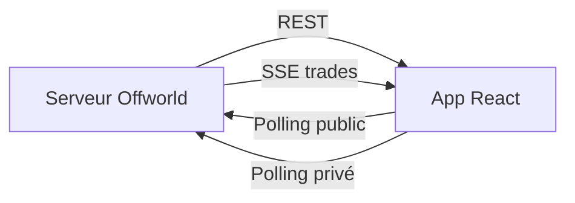

# Offworld Pixel Ops

Dashboard React qui visualise le serveur Offworld.

## Rôle

- afficher la galaxie
- suivre les trades en direct
- montrer les crédits, ordres, vaisseaux et classement

## Lancement

```bash
cd frontend
npm install
npm run dev
```

Ouvrir ensuite `http://localhost:5173`.

## Build

```bash
npm run build
npm run lint
```

## Configuration

Le proxy Vite en développement redirige :

```text
/api/* -> http://localhost:3000
```

À la connexion, l'interface demande :

- l'URL du serveur
- le `player-id`
- l'`api-key`

## Flux de données



## Patterns utilisés

- `fetch` pour les chargements initiaux
- SSE pour le flux de trades
- `setInterval` pour le polling public et privé
- React state pour refléter les changements à l'écran
