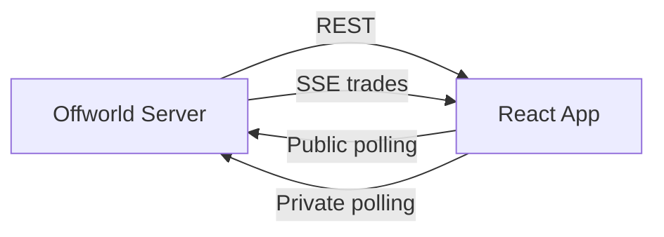

# Offworld Pixel Ops

React dashboard that visualizes the Offworld server.

## Role

- display the galaxy
- track trades in real-time
- show credits, orders, ships and leaderboard

## Getting started

```bash
cd frontend
npm install
npm run dev
```

Then open `http://localhost:5173`.

## Build

```bash
npm run build
npm run lint
```

## Configuration

The Vite proxy in development redirects:

```text
/api/* -> http://localhost:3000
```

At connection, the interface asks for:

- server URL
- `player-id`
- `api-key`

## Data flow



## Patterns used

- `fetch` for initial loads
- SSE for the trade stream
- `setInterval` for public and private polling
- React state to reflect changes on screen
